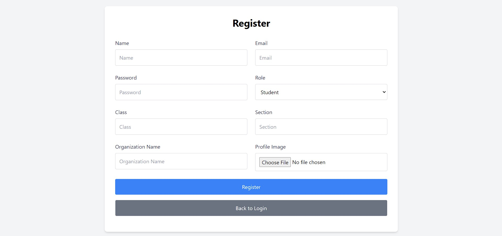
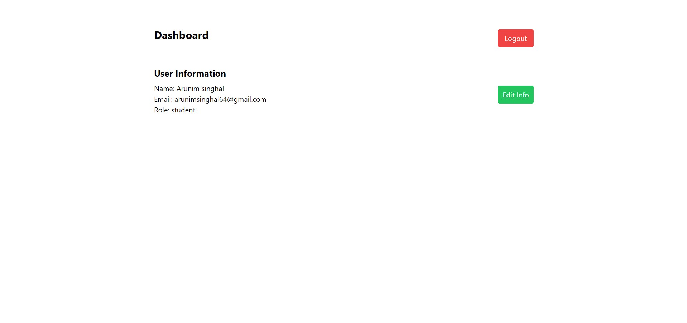
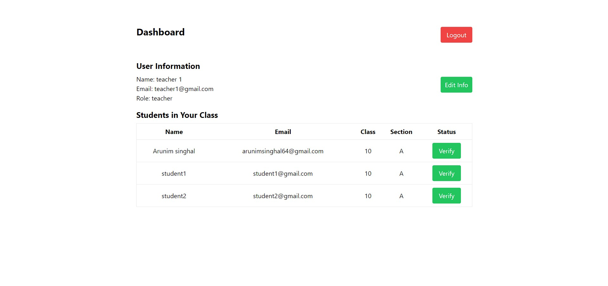
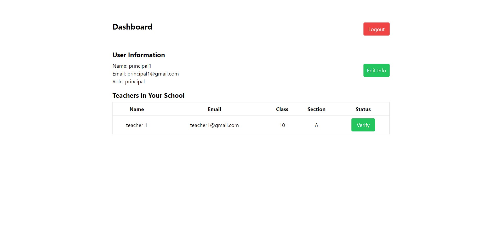

# User Management Dashboard

## Project Overview

This project is a user management dashboard that allows users to register and log in to view and manage their profiles. Depending on their role (student, teacher, or principal), users will have different functionalities available. Teachers can view and verify students in their class, while principals can view the list of teachers in their organization.

## Features

- User registration with profile picture upload
- User login with JWT authentication
- Different views for students, teachers, and principals
- Teachers can verify students in their class and section
- Profile editing functionality

## Technologies Used

- Backend: Node.js, Express.js, MongoDB, Mongoose
- Frontend: React.js, Context API
- Authentication: JWT (JSON Web Token)
- File Upload: Multer

## Getting Started

### Prerequisites

- Node.js and npm installed
- MongoDB installed and running

### Installation

1. Clone the repository:

   ```sh
   git clone https://github.com/your-username/user-management-dashboard.git
   cd user-management-dashboard
   ```

2. Install backend dependencies:

   ```sh
   cd backend
   npm install
   ```

3. Install frontend dependencies:

   ```sh
   cd ../frontend
   npm install
   ```

### Configuration

1. Create a \`.env\` file in the \`backend\` directory and add the following environment variables:

   ```env
   MONGO_URI=<your-mongodb-uri>
   JWT_SECRET=<your-jwt-secret>
   ```

2. Start the backend server:

   ```bash
   cd backend
   npm start
   ```

3. Start the frontend development server:

   ```bash
   cd ../frontend
   npm start
   ```

## API Endpoints

### Authentication

- **Register User:** `POST /api/auth/register`
- **Login User:** `POST /api/auth/login`

### User Management

- **Get User Data:** `GET /api/auth/user`
- **Update User Data:** `PUT /api/auth/update/:id`
- **Verify Student:** `POST /api/auth/verify-student/:id`

## Frontend Components

### Login Page

- **Path:** `/login`
- **Description:** Allows users to log in to their accounts.

### Register Page

- **Path:** `/register`
- **Description:** Allows users to create a new account with profile picture upload.

### Dashboard

- **Path:** `/dashboard`
- **Description:** Displays user information and additional features based on user role.

  - **Student View:** Shows personal information.
  - **Teacher View:** Shows personal information and a list of students in the same class and section.
  - **Principal View:** Shows personal information and a list of teachers in the same organization.

### Edit User

- **Component:** `<EditUser />`
- **Description:** Allows users to edit their profile details, including updating their profile picture.

## Screenshots

### Login Page


### Register Page


### Student Dashboard


### Teacher Dashboard


### Principal Dashboard


## License

This project is licensed under the MIT License.
